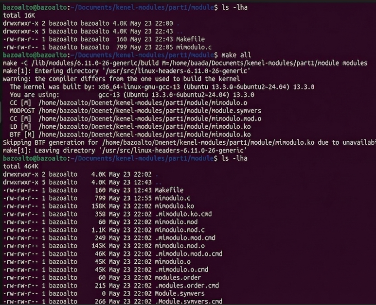
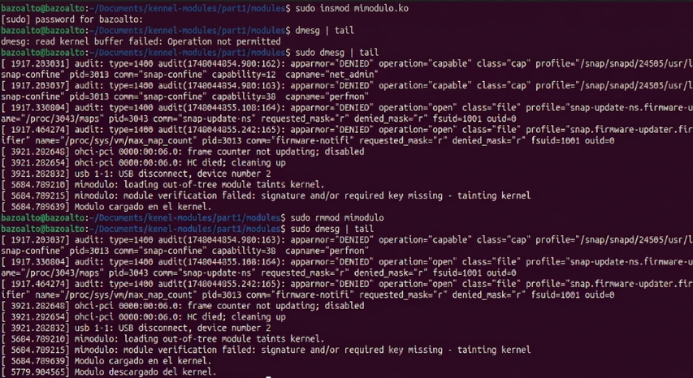
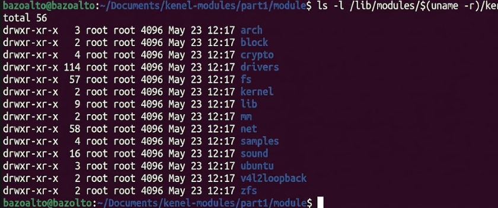
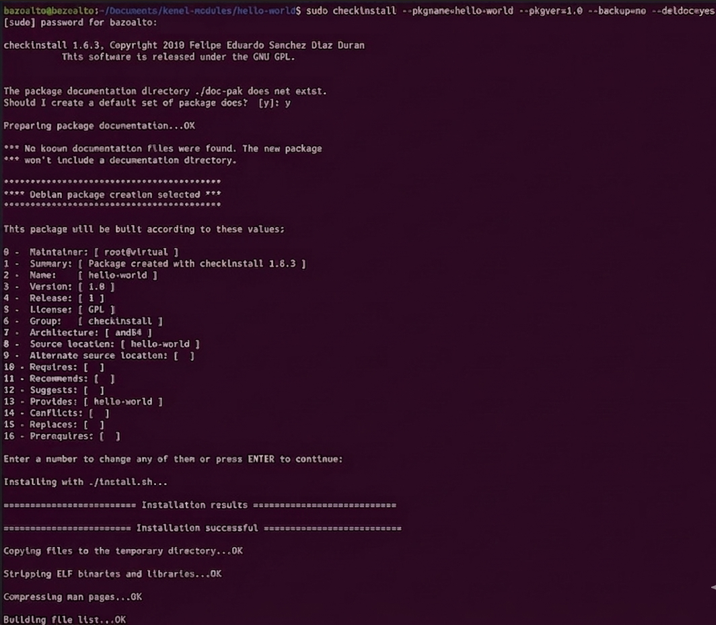

## Trabajo Practico N4
## Introducción
## ¿Qué es exactamente un módulo del núcleo? 

Los módulos son fragmentos de código que se pueden cargar y descargar en el kernel según se requiera. Extienden la funcionalidad del kernel sin necesidad de reiniciar el sistema. Por ejemplo, un tipo de módulo es el controlador de dispositivo, que permite que el núcleo acceda al hardware conectado al sistema. Sin módulos, tendríamos que construir kernels monolíticos y agregar nuevas funciones directamente en la imagen del kernel. Además de tener kernels más grandes, esto tiene la desventaja de requerir que reconstruyamos y reiniciemos el kernel cada vez que queramos una nueva funcionalidad.

## ¿Qué es el Kernel?
El kernel, también conocido como núcleo, es el corazón del sistema operativo. Es esa capa intermedia que se encarga de que el software pueda usar el hardware sin tener que lidiar con sus complejidades. Está presente en cualquier sistema operativo moderno, desde Windows hasta Linux, siendo este último uno de los más conocidos por ser de código abierto.El kernel es como un "organizador" que reparte los recursos del hardware (como CPU, memoria o dispositivos) entre los programas que los necesitan. Se encarga de decidir quién usa qué, cuánto y cuándo. También es el guardián que evita que un programa interfiera con otro o acceda a partes del sistema que no debería. Esto lo hace crucial para la seguridad y estabilidad general.

## ¿Que son los modulos del kernel?
Los módulos del kernel son componentes que permiten agregar funciones al núcleo del sistema operativo Linux de manera dinámica. Gracias a que el kernel de Linux es modular, se pueden cargar o eliminar módulos sin necesidad de reiniciar el sistema ni recompilar todo el núcleo. Esto facilita la adaptación del sistema al hardware disponible y mejora su flexibilidad.

Entre las funciones que pueden incorporarse mediante módulos se encuentran los controladores para nuevas tarjetas gráficas, el soporte para sensores de temperatura y la compatibilidad con placas de red. Los módulos se cargan únicamente cuando son necesarios, optimizando así el uso de recursos y permitiendo que el sistema funcione de forma más eficiente.

## ¿Qué es checkinstall y para qué sirve?

Cuando un programa se instala en Linux a partir de su código fuente, generalmente se utilizan comandos como ./configure, make y make install. Sin embargo, este método tiene la desventaja de que el sistema no registra automáticamente qué archivos fueron copiados ni facilita su eliminación posterior. Para solucionar este inconveniente existe CheckInstall, una herramienta que convierte la instalación manual en un paquete instalable, como .deb o .rpm según la distribución utilizada. Gracias a esto, el software puede administrarse mediante el gestor de paquetes del sistema, permitiendo realizar desinstalaciones, actualizaciones y un control más ordenado y seguro de los programas instalados.

# PARA DESARROLLAR LA ACTIVIDAD

Para trabajar con módulos del kernel en Linux es necesario contar con un entorno adecuado y tener instalados tanto las herramientas de compilación como el código fuente o los encabezados del kernel. El paquete build-essential proporciona utilidades esenciales como gcc y make, necesarias para compilar programas y módulos, mientras que linux-source instala los archivos requeridos para desarrollar módulos propios del kernel.

El proyecto se organiza dentro de una carpeta llamada module, que contiene un archivo Makefile, encargado de automatizar el proceso de compilación, y un archivo .c con el código fuente del módulo. Para gestionar la compilación se utilizan distintos comandos: make clean elimina archivos generados en compilaciones anteriores, make all compila el módulo y crea el archivo .ko, que corresponde al módulo del kernel, y ls -lha permite visualizar información detallada de los archivos generados en la carpeta.

[]()

Una vez compilado el módulo del kernel, se genera un archivo con extensión .ko dentro de la carpeta module. Para obtener información sobre el módulo, como el autor, la licencia y sus dependencias, se utiliza el comando modinfo. El módulo puede cargarse en el kernel mediante sudo insmod mimodulo.ko y descargarse con sudo rmmod mimodulo.ko. Además, el comando lsmod permite visualizar todos los módulos que se encuentran actualmente cargados en el sistema. Para verificar que el módulo se haya cargado o eliminado correctamente, se pueden consultar los mensajes del kernel utilizando dmesg, donde se muestran los registros generados durante estas operaciones.

[]()

Para ver los módulos del kernel instalados:

[]()


## Crear un paquete con CheckInstall: Ejemplo con Hello World

1. **Se instala CheckInstall:**

```bash
sudo apt-get update
sudo apt-get install checkinstall
```

2. **Se escribe el código fuente:**
   Archivo `hello.c`:

```c
#include <stdio.h>
int main() {
    printf("HELLO WORLD!\n");
    return 0;
}
```

3. **Se compila el código fuente:**

```bash
gcc -o hello hello.c
```

4. **Se crea un script de instalación:**
   Archivo `install.sh`:

```bash
#!/bin/bash
cp hello /usr/local/bin/
```

5. **Se hace ejecutable el script e instalá con CheckInstall:**

```bash
chmod +x install.sh
sudo checkinstall --pkgname=hello-world --pkgversion=1.0 --backup=no --deldoc=yes --default ./install.sh
```

La salida de este comando es la siguiente:
[]()

Esto generará un archivo `.deb` que se instalará en tu sistema y que luego podés remover con:

```bash
sudo dpkg -r hello-world
```
 
[]()

## Para mejorar la seguridad del kernel, concretamente: evitando cargar módulos que no estén firmados
Cuando trabajamos con módulos del kernel, la seguridad es un aspecto crítico. Cargar un módulo es darle acceso directo al corazón del sistema, por eso es fundamental garantizar su integridad y autenticidad. Una forma de hacerlo es mediante la firma digital de módulos.Firmar un módulo permite verificar que no ha sido alterado desde que fue creado. Es especialmente importante si tenés Secure Boot activado, ya que éste bloquea la carga de módulos no firmados como medida de protección ante software malicioso.

## Firmado de Módulos: Pasos
Crear un certificado SSL:
Usá OpenSSL y un archivo .cnf que describe los atributos del certificado. Ejemplo básico:
```ini
[ req ]
distinguished_name = req_distinguished_name
x509_extensions = v3
prompt = no

[ req_distinguished_name ]
countryName = AR
stateOrProvinceName = Cordoba
localityName = Cordoba
organizationName = UNC
commonName = FirmaDeModulo

[ v3 ]
basicConstraints = CA:FALSE
keyUsage = digitalSignature
extendedKeyUsage = codeSigning
```

Generá las claves:

```bash
openssl req -config openssl.cnf -new -x509 -newkey rsa:2048 -nodes -days 36500 -outform DER \
-keyout MOK.priv -out MOK.der
```

2. **Registrar la clave en el sistema (enroll):**

```bash
sudo mokutil --import MOK.der
```

Esto activa un proceso de confirmación al reiniciar desde el entorno UEFI.

3. **Firmar el módulo compilado:**

```bash
sudo /usr/src/linux-headers-$(uname -r)/scripts/sign-file sha256 MOK.priv MOK.der mimodulo.ko
```

4. **Verificar la firma:**

```bash
modinfo mimodulo.ko
```

### Medidas adicionales de seguridad

 Algunas estrategias extra para fortalecer la seguridad del kernel incluyen:

* **Prevención de desbordamientos de búfer (buffer overflow):** mitigando vulnerabilidades comunes.
* **Protección de memoria crítica:** evitando escrituras no autorizadas en estructuras internas del kernel.
* **Uso de herramientas como LKRG:** para detectar modificaciones del kernel en tiempo real.
* **Políticas de acceso:** como SELinux o AppArmor para restringir lo que pueden hacer usuarios y procesos.
* **Randomización de memoria (ASLR):** moviendo aleatoriamente datos sensibles en la RAM para prevenir ataques.

---
## ¿Qué funciones tiene disponible un programa y un módulo ?
Un programa común en Linux se ejecuta en espacio de usuario (user space), donde dispone de funciones proporcionadas por bibliotecas estándar del sistema, como printf(), scanf(), malloc() o fopen(). Estas funciones permiten trabajar con archivos, memoria, procesos y entrada/salida, pero con permisos limitados y sin acceso directo al hardware.

En cambio, un módulo del kernel se ejecuta en espacio del kernel (kernel space), por lo que posee privilegios mucho mayores y acceso directo a recursos internos del sistema operativo y dispositivos físicos. Debido a esto, utiliza funciones específicas del kernel como printk(), kmalloc(), copy_to_user() y copy_from_user(). Los módulos suelen utilizarse para implementar drivers, sistemas de archivos y soporte para hardware.

El espacio de usuario está destinado a programas normales y aplicaciones, mientras que el espacio del kernel contiene el núcleo del sistema operativo y los módulos cargados. Esta separación mejora la seguridad y estabilidad del sistema, ya que un error en un programa de usuario normalmente no afecta al kernel.

El espacio de datos corresponde a la región de memoria utilizada para almacenar variables y datos durante la ejecución de un proceso. Incluye variables globales, variables estáticas, memoria dinámica y pila de ejecución.

Los drivers son controladores que permiten la comunicación entre el sistema operativo y dispositivos de hardware como discos, teclados, cámaras o placas de red. En Linux, muchos dispositivos son representados mediante archivos especiales ubicados en el directorio /dev.

Dentro de /dev pueden encontrarse archivos como:

## /dev/sda → discos duros
## /dev/tty → terminales
## /dev/null → descarta información
## /dev/random → generador de números aleatorios
## /dev/video0 → cámaras web

Gracias a esto, Linux trata muchos dispositivos como archivos, permitiendo interactuar con ellos mediante operaciones estándar de lectura y escritura.

## DESAFIO 2 

## 1. ¿Que diferencias se pueden observar entre los dos modinfo?

Se comparó un módulo desarrollado manualmente (`mimodulo.ko`) con un módulo oficial del kernel (`des_generic.ko.xz`):


**Diferencias observadas**:

### Cantidad de metadata
El módulo `mimodulo.ko` contiene únicamente información básica:
- autor
- descripción
- licencia
- nombre
- versión del kernel (`vermagic`)

En cambio, `des_generic.ko.xz` posee mucha más metadata asociada al módulo.

### Firma digital del módulo
El módulo oficial del kernel incluye información de firma criptográfica:

- `sig_id`
- `signer`
- `sig_key`
- `sig_hashalgo`
- `signature`

Esto indica que el módulo fue firmado digitalmente por **Fedora** usando **PKCS#7** y **SHA256**.

El módulo propio no posee firma digital.

### Módulo oficial vs módulo externo

El módulo `des_generic` contiene:
```bash
intree: Y
```

Esto indica que pertenece al árbol oficial del kernel de Linux (*in-tree module*).

El módulo `mimodulo` no posee ese campo porque fue compilado externamente (*out-of-tree module*).

### Dependencias

El módulo oficial posee dependencias:
```bash
depends: libdes
```

Esto significa que requiere de otros módulos para funciona correctamente.

El módulo propio no depende de ningún otro módulo.

### Aliases

El módulo oficial posee múltiples aliases:
```bash
alias: crypto-des
alias: des
alias: des3_ede
```

Los aliases permiten que el kernel cargue automáticamente el módulo cuando algún componente solicita soporte criptográfico DES.

El módulo propio no posee aliases.

### Compresión del módulo

El móudulo oficial se encuentra comprimido:
```bash
des_generic.ko.xz
```
Fedora comprime muchos módulos del kernel para reducir espacio en disco.

El módulo propio no está comprimido.

### Información en común

Ambos módulos comparten algunos campos:

- licencia GPL
- soporte `retpoline`
- mismo `vermagic`

El `vermagic` indica compatibilidad con la versión actual del kernel.

## 2. ¿Qué drivers/modulos estan cargados en sus propias PC? Comparar las salidas con las computadoras de cada integrante del grupo. Expliquen las diferencias. 

Podemos ver los lsmod de cada integrante en:
- [lsmod-benja](/trabajo4/lsmod_benja.txt)

## 3. ¿Cuales no están cargados pero están disponibles? Que pasa cuando el driver de un dispositivo no está disponible. 

Con el comando
```bash
find /lib/modules/$(uname -r) -name "*.ko*" | less
```

podemos ver los módulos disponibles. Son un montón, adjuntamos los primeros que aparecen:


Vamos a verificar que el módulo Bluetooth está disponible en el sistema:


En efecto se encuentra disponible, pero si revisamos la salida de lsmod en el txt generado en el punto anterior ([lsmod-benja](/trabajo4/lsmod_benja.txt)) veremos que no aparece.

Esto quiere decir que el driver esta disponible en el sistema, pero actualmente no está siendo utilizado/cargado.

Cuando el driver de un dispositivo no está disponible, el sistema operativo no puede comunicarse correctamente con el hardware. Como consecuencia, el dispositivo puede no funcionar o funcionar de manera limitada.

Por ejemplo:
- Una placa de red puede no tener conectividad
- Una GPU puede funcionar sin aceleración gráfica
- Una impresora puede no ser detectada
- El audio puede no funcionar

En Linux, si el módulo existe pero no está cargado, puede cargarse manualmente usando `modprobe`. Si el driver no existe en el sistema, normalmente es necesario instalarlo o compilarlo.

## 4. Correr hwinfo en una pc real con hw real y agregar la url de la información de hw en el reporte. 

Se puede ver el reporte de hwinfo en [hwinfo_reporte](/trabajo4/hwinfo_benja.txt)

## 5. ¿Qué diferencia existe entre un módulo y un programa?

Un programa es una aplicación que se ejecuta en espacio de usuario (*user space*), mientras que un módulo del kernel se ejecuta en espacio del kernel (*kernel space*).

### Programa

* Se ejecuta como un proceso independiente.
* Tiene memoria protegida y aislada.
* Utiliza llamadas al sistema (*syscalls*) para comunicarse con el kernel.
* Si falla normalmente solo termina el proceso.

Ejemplos:

* Firefox
* VLC
* un `helloworld` en C

---

### Módulo del kernel

* Se carga dinámicamente dentro del kernel.
* Tiene acceso directo al hardware y memoria del sistema.
* Extiende funcionalidades del kernel.
* Un error puede comprometer todo el sistema operativo.

Ejemplos:

* drivers WiFi
* drivers GPU
* sistemas de archivos
* módulos criptográficos

---

### Diferencias principales

| Programa                                  | Módulo                      |
| ----------------------------------------- | --------------------------- |
| User space                                | Kernel space                |
| Acceso limitado al hardware               | Acceso completo al hardware |
| Usa syscalls                              | Forma parte del kernel      |
| Más seguro                                | Más riesgoso                |
| Si falla normalmente no afecta al sistema | Puede provocar kernel panic |

---

## 6. ¿Cómo puede ver una lista de las llamadas al sistema que realiza un simple helloworld en C?

Las llamadas al sistema pueden verse utilizando `strace`.

Primero se compila un programa simple:

```c id="hhdlkp"
#include <stdio.h>

int main() {
    printf("Hola mundo\n");
    return 0;
}
```

Compilación:

```bash id="stvhqt"
gcc hola.c -o hola
```

Luego se ejecuta con:

```bash id="lm4xan"
strace ./hola
```

Esto muestra las system calls realizadas por el programa, por ejemplo:

* `open`
* `read`
* `write`
* `mmap`
* `close`
* `exit`

Aunque el programa sea muy simple, el sistema operativo realiza múltiples llamadas al sistema para cargar bibliotecas, reservar memoria y escribir en pantalla.

---

## 7. ¿Qué es un segmentation fault? ¿Cómo lo maneja el kernel y cómo lo hace un programa?

Un *segmentation fault* ocurre cuando un programa intenta acceder a una región de memoria inválida o sin permisos.

Por ejemplo:

* acceder a un puntero NULL
* escribir fuera de un arreglo
* acceder a memoria liberada
* ejecutar memoria no ejecutable

Ejemplo:

```c id="v8l0m9"
int *p = NULL;
*p = 10;
```

Esto genera un `Segmentation Fault`.

---

### ¿Cómo lo maneja el kernel?

El kernel utiliza la MMU (*Memory Management Unit*) y las tablas de páginas para proteger la memoria de cada proceso.

Cuando un proceso accede a memoria inválida:

1. la CPU genera una excepción de hardware (*page fault*)
2. el kernel detecta el acceso inválido
3. el kernel envía la señal `SIGSEGV`
4. normalmente el proceso es finalizado

Esto evita que un proceso dañe memoria de otros procesos o del propio kernel.

---

### ¿Cómo puede manejarlo un programa?

Un programa puede capturar la señal `SIGSEGV` usando manejadores de señales:

```c id="n9bivf"
signal(SIGSEGV, handler);
```

aunque normalmente un segmentation fault indica un bug grave y lo correcto es corregir el error de memoria.

Herramientas útiles para detectar estos errores:

* `gdb`
* `valgrind`
* `AddressSanitizer`
* `strace`

## 8. ¿Se animan a intentar firmar un módulo de kernel ? y documentar el proceso ?  

## 9. Agregar evidencia de la compilación, carga y descarga de su propio módulo imprimiendo el nombre del equipo en los registros del kernel. 

## 10. ¿Que pasa si mi compañero con secure boot habilitado intenta cargar un módulo firmado por mi? 

## 11. Dada la siguiente nota:

https://arstechnica.com/security/2024/08/a-patch-microsoft-spent-2-years-preparing-is-making-a-mess-for-some-linux-users/ 

### ¿Cuál fue la consecuencia principal del parche de Microsoft sobre GRUB en sistemas con arranque dual (Linux y Windows)?

La principal consecuencia del parche de seguridad aplicado por Microsoft fue que muchos sistemas con arranque dual dejaron de poder iniciar Linux correctamente. Esto ocurrió porque la actualización revocó antiguas claves de firma utilizadas por versiones previas de GRUB y shim, componentes fundamentales en el proceso de arranque seguro de distribuciones Linux. Al actualizar la base de datos de claves confiables de UEFI para corregir vulnerabilidades de seguridad, el firmware comenzó a rechazar cargadores Linux que no contaban con firmas nuevas y válidas. Como resultado, en numerosos equipos el sistema bloqueaba la ejecución de GRUB, mostraba errores de firma inválida o iniciaba directamente Windows, provocando que el arranque dual quedara inutilizable para muchos usuarios.

### ¿Qué implicancia tiene desactivar Secure Boot como solución al problema descrito en el artículo?
Deshabilitar Secure Boot permite iniciar el sistema utilizando cualquier cargador de arranque o kernel sin necesidad de verificar firmas digitales, lo que muchas veces facilita resolver problemas de compatibilidad o arranque. Sin embargo, al hacerlo se elimina una importante medida de seguridad, ya que el firmware deja de comprobar si los componentes de inicio fueron modificados o si provienen de una fuente confiable. Como consecuencia, el sistema queda más expuesto a amenazas como bootkits y rootkits capaces de ejecutarse antes de que cargue el sistema operativo, obteniendo un alto nivel de control y ocultándose con mayor facilidad. Aunque desactivar Secure Boot puede resultar una solución práctica en algunos casos, también implica un riesgo considerable, especialmente en equipos donde la seguridad e integridad de la información son fundamentales, como servidores, entornos empresariales o computadoras personales con datos sensibles.

### ¿Cuál es el propósito principal del Secure Boot en el proceso de arranque de un sistema?
El propósito principal de Secure Boot es proteger el proceso de arranque del sistema evitando la ejecución de software no confiable o malicioso antes de que el sistema operativo se inicie completamente. Esta característica, incorporada en el firmware UEFI, utiliza una serie de claves criptográficas almacenadas en una base de datos de confianza para verificar la autenticidad de cada componente que participa en el arranque. De esta manera, únicamente se permite ejecutar cargadores de arranque, kernels y módulos que estén correctamente firmados digitalmente. Gracias a esta verificación se mantiene una cadena de confianza desde el firmware hasta el kernel del sistema operativo, reduciendo significativamente el riesgo de ataques como bootkits y rootkits persistentes, los cuales intentan instalarse en etapas tempranas del arranque para obtener control total del sistema y permanecer ocultos incluso después de reinstalar el sistema operativo.
