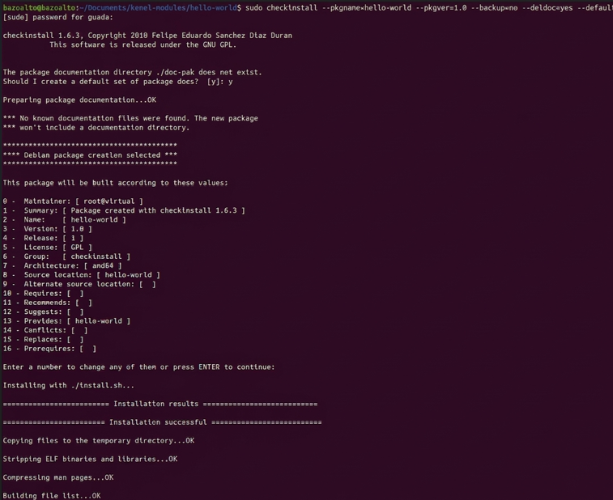
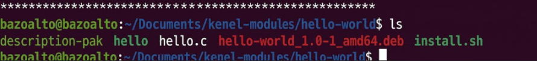

## Trabajo Practico N4
## Introducción
## ¿Qué es exactamente un módulo del núcleo? 

Los módulos son fragmentos de código que se pueden cargar y descargar en el kernel según se requiera. Extienden la funcionalidad del kernel sin necesidad de reiniciar el sistema. Por ejemplo, un tipo de módulo es el controlador de dispositivo, que permite que el núcleo acceda al hardware conectado al sistema. Sin módulos, tendríamos que construir kernels monolíticos y agregar nuevas funciones directamente en la imagen del kernel. Además de tener kernels más grandes, esto tiene la desventaja de requerir que reconstruyamos y reiniciemos el kernel cada vez que queramos una nueva funcionalidad.

## ¿Qué es checkinstall y para qué sirve?

Cuando un programa se instala en Linux a partir de su código fuente, generalmente se utilizan comandos como ./configure, make y make install. Sin embargo, este método tiene la desventaja de que el sistema no registra automáticamente qué archivos fueron copiados ni facilita su eliminación posterior. Para solucionar este inconveniente existe CheckInstall, una herramienta que convierte la instalación manual en un paquete instalable, como .deb o .rpm según la distribución utilizada. Gracias a esto, el software puede administrarse mediante el gestor de paquetes del sistema, permitiendo realizar desinstalaciones, actualizaciones y un control más ordenado y seguro de los programas instalados.
## Crear un paquete con CheckInstall: Ejemplo con Hello World

1. **Se instala CheckInstall:**

```bash
sudo apt-get update
sudo apt-get install checkinstall
```

2. **Se escribe el código fuente:**
   Archivo `hello.c`:

```c
#include <stdio.h>
int main() {
    printf("HELLO WORLD!\n");
    return 0;
}
```

3. **Se compila el código fuente:**

```bash
gcc -o hello hello.c
```

4. **Se crea un script de instalación:**
   Archivo `install.sh`:

```bash
#!/bin/bash
cp hello /usr/local/bin/
```

5. **Se hace ejecutable el script e instalá con CheckInstall:**

```bash
chmod +x install.sh
sudo checkinstall --pkgname=hello-world --pkgversion=1.0 --backup=no --deldoc=yes --default ./install.sh
```

La salida de este comando es la siguiente:
[]()

Esto generará un archivo `.deb` que se instalará en tu sistema y que luego podés remover con:

```bash
sudo dpkg -r hello-world
```
 
[]()

## Para mejorar la seguridad del kernel, concretamente: evitando cargar módulos que no estén firmados
Cuando trabajamos con módulos del kernel, la seguridad es un aspecto crítico. Cargar un módulo es darle acceso directo al corazón del sistema, por eso es fundamental garantizar su integridad y autenticidad. Una forma de hacerlo es mediante la firma digital de módulos.

## ¿Por qué firmar un módulo?
Firmar un módulo permite verificar que no ha sido alterado desde que fue creado. Es especialmente importante si tenés Secure Boot activado, ya que éste bloquea la carga de módulos no firmados como medida de protección ante software malicioso.

## Firmado de Módulos: Pasos
Crear un certificado SSL:
Usá OpenSSL y un archivo .cnf que describe los atributos del certificado. Ejemplo básico:
```ini
[ req ]
distinguished_name = req_distinguished_name
x509_extensions = v3
prompt = no

[ req_distinguished_name ]
countryName = AR
stateOrProvinceName = Cordoba
localityName = Cordoba
organizationName = UNC
commonName = FirmaDeModulo

[ v3 ]
basicConstraints = CA:FALSE
keyUsage = digitalSignature
extendedKeyUsage = codeSigning
```

Generá las claves:

```bash
openssl req -config openssl.cnf -new -x509 -newkey rsa:2048 -nodes -days 36500 -outform DER \
-keyout MOK.priv -out MOK.der
```

2. **Registrar la clave en el sistema (enroll):**

```bash
sudo mokutil --import MOK.der
```

Esto activa un proceso de confirmación al reiniciar desde el entorno UEFI.

3. **Firmar el módulo compilado:**

```bash
sudo /usr/src/linux-headers-$(uname -r)/scripts/sign-file sha256 MOK.priv MOK.der mimodulo.ko
```

4. **Verificar la firma:**

```bash
modinfo mimodulo.ko
```

### Medidas adicionales de seguridad

Firmar módulos es sólo una parte. Algunas estrategias extra para fortalecer la seguridad del kernel incluyen:

* **Prevención de desbordamientos de búfer (buffer overflow):** mitigando vulnerabilidades comunes.
* **Protección de memoria crítica:** evitando escrituras no autorizadas en estructuras internas del kernel.
* **Uso de herramientas como LKRG:** para detectar modificaciones del kernel en tiempo real.
* **Políticas de acceso:** como SELinux o AppArmor para restringir lo que pueden hacer usuarios y procesos.
* **Randomización de memoria (ASLR):** moviendo aleatoriamente datos sensibles en la RAM para prevenir ataques.

---
## ¿Qué funciones tiene disponible un programa y un módulo ?
Un programa común en Linux se ejecuta en espacio de usuario (user space), donde dispone de funciones proporcionadas por bibliotecas estándar del sistema, como printf(), scanf(), malloc() o fopen(). Estas funciones permiten trabajar con archivos, memoria, procesos y entrada/salida, pero con permisos limitados y sin acceso directo al hardware.

En cambio, un módulo del kernel se ejecuta en espacio del kernel (kernel space), por lo que posee privilegios mucho mayores y acceso directo a recursos internos del sistema operativo y dispositivos físicos. Debido a esto, utiliza funciones específicas del kernel como printk(), kmalloc(), copy_to_user() y copy_from_user(). Los módulos suelen utilizarse para implementar drivers, sistemas de archivos y soporte para hardware.

El espacio de usuario está destinado a programas normales y aplicaciones, mientras que el espacio del kernel contiene el núcleo del sistema operativo y los módulos cargados. Esta separación mejora la seguridad y estabilidad del sistema, ya que un error en un programa de usuario normalmente no afecta al kernel.

El espacio de datos corresponde a la región de memoria utilizada para almacenar variables y datos durante la ejecución de un proceso. Incluye variables globales, variables estáticas, memoria dinámica y pila de ejecución.

Los drivers son controladores que permiten la comunicación entre el sistema operativo y dispositivos de hardware como discos, teclados, cámaras o placas de red. En Linux, muchos dispositivos son representados mediante archivos especiales ubicados en el directorio /dev.

Dentro de /dev pueden encontrarse archivos como:

## /dev/sda → discos duros
## /dev/tty → terminales
## /dev/null → descarta información
## /dev/random → generador de números aleatorios
## /dev/video0 → cámaras web

Gracias a esto, Linux trata muchos dispositivos como archivos, permitiendo interactuar con ellos mediante operaciones estándar de lectura y escritura.

## DESAFIO 2 

## 1¿Qué diferencias se pueden observar entre los dos modinfo ? 
## 2¿Qué divers/modulos estan cargados en sus propias pc? comparar las salidas con las computadoras de cada integrante del grupo. Expliquen las diferencias. Carguen un txt con la salida de cada integrante en el repo y pongan un diff en el informe.
## 3¿cuales no están cargados pero están disponibles? que pasa cuando el driver de un dispositivo no está disponible. 
Correr hwinfo en una pc real con hw real y agregar la url de la información de hw en el reporte. 
## 4¿Qué diferencia existe entre un módulo y un programa  ? 
## 5¿Cómo puede ver una lista de las llamadas al sistema que realiza un simple helloworld en c?
## 6¿Qué es un segmentation fault? ¿Cómo lo maneja el kernel y como lo hace un programa?
## 7¿Se animan a intentar firmar un módulo de kernel ? y documentar el proceso ?  
https://askubuntu.com/questions/770205/how-to-sign-kernel-modules-with-sign-file
Agregar evidencia de la compilación, carga y descarga de su propio módulo imprimiendo el nombre del equipo en los registros del kernel. 
## 8¿Que pasa si mi compañero con secure boot habilitado intenta cargar un módulo firmado por mi? 
Dada la siguiente nota https://arstechnica.com/security/2024/08/a-patch-microsoft-spent-2-years-preparing-is-making-a-mess-for-some-linux-users/ 
## ¿Cuál fue la consecuencia principal del parche de Microsoft sobre GRUB en sistemas con arranque dual (Linux y Windows)?

La principal consecuencia del parche de seguridad aplicado por Microsoft fue que muchos sistemas con arranque dual dejaron de poder iniciar Linux correctamente. Esto ocurrió porque la actualización revocó antiguas claves de firma utilizadas por versiones previas de GRUB y shim, componentes fundamentales en el proceso de arranque seguro de distribuciones Linux. Al actualizar la base de datos de claves confiables de UEFI para corregir vulnerabilidades de seguridad, el firmware comenzó a rechazar cargadores Linux que no contaban con firmas nuevas y válidas. Como resultado, en numerosos equipos el sistema bloqueaba la ejecución de GRUB, mostraba errores de firma inválida o iniciaba directamente Windows, provocando que el arranque dual quedara inutilizable para muchos usuarios.

## ¿Qué implicancia tiene desactivar Secure Boot como solución al problema descrito en el artículo?
Deshabilitar Secure Boot permite iniciar el sistema utilizando cualquier cargador de arranque o kernel sin necesidad de verificar firmas digitales, lo que muchas veces facilita resolver problemas de compatibilidad o arranque. Sin embargo, al hacerlo se elimina una importante medida de seguridad, ya que el firmware deja de comprobar si los componentes de inicio fueron modificados o si provienen de una fuente confiable. Como consecuencia, el sistema queda más expuesto a amenazas como bootkits y rootkits capaces de ejecutarse antes de que cargue el sistema operativo, obteniendo un alto nivel de control y ocultándose con mayor facilidad. Aunque desactivar Secure Boot puede resultar una solución práctica en algunos casos, también implica un riesgo considerable, especialmente en equipos donde la seguridad e integridad de la información son fundamentales, como servidores, entornos empresariales o computadoras personales con datos sensibles.

## ¿Cuál es el propósito principal del Secure Boot en el proceso de arranque de un sistema?
El propósito principal de Secure Boot es proteger el proceso de arranque del sistema evitando la ejecución de software no confiable o malicioso antes de que el sistema operativo se inicie completamente. Esta característica, incorporada en el firmware UEFI, utiliza una serie de claves criptográficas almacenadas en una base de datos de confianza para verificar la autenticidad de cada componente que participa en el arranque. De esta manera, únicamente se permite ejecutar cargadores de arranque, kernels y módulos que estén correctamente firmados digitalmente. Gracias a esta verificación se mantiene una cadena de confianza desde el firmware hasta el kernel del sistema operativo, reduciendo significativamente el riesgo de ataques como bootkits y rootkits persistentes, los cuales intentan instalarse en etapas tempranas del arranque para obtener control total del sistema y permanecer ocultos incluso después de reinstalar el sistema operativo.


